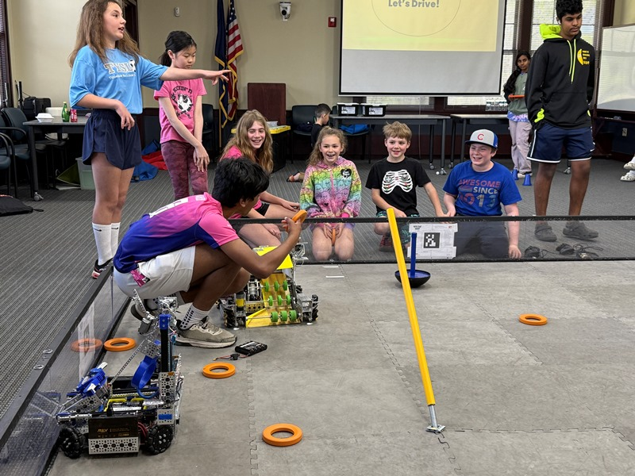
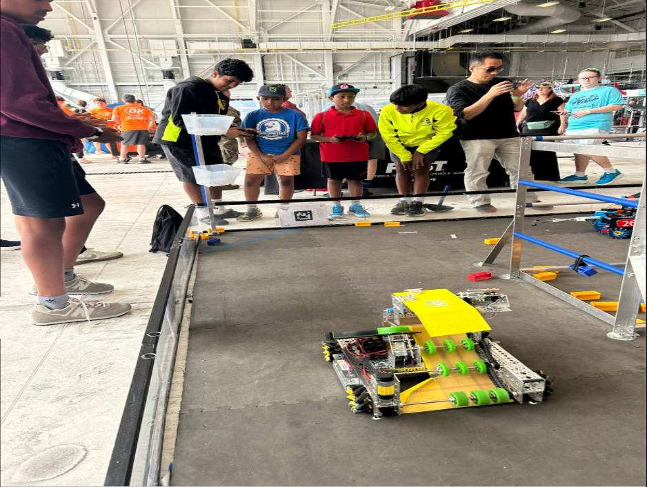
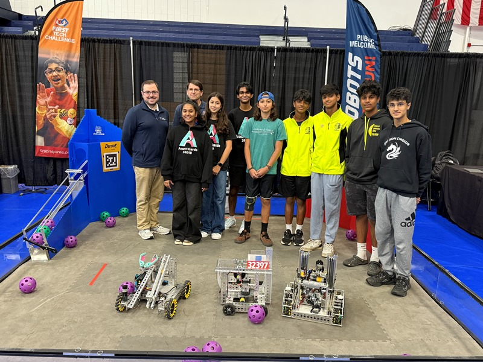
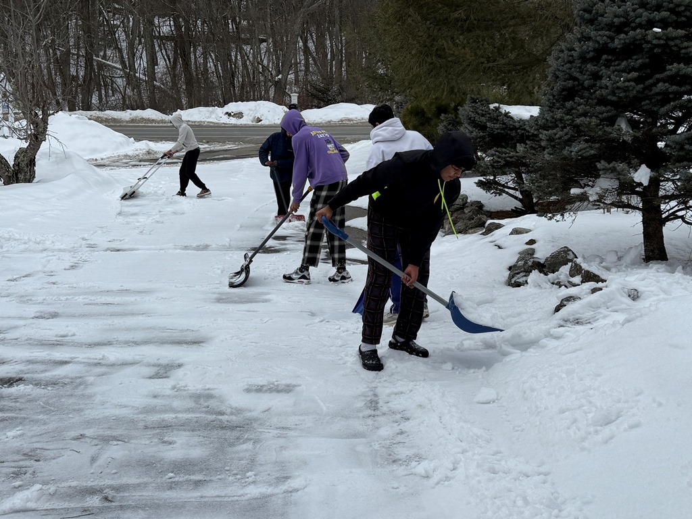

# Our Community Outreach

## Londonderry YMCA

At this event, Banana Box and our sister team Blue Box introduced FTC to the public. This included children, parents, FLL members, and various professionals including the Londonderry YMCA Board. They said they would push to bring FLL Nationwide YMCA. In addition, we started this plan by helping create 6 FIRST robotics teams at YMCA Londonderry, 3 of which have already started participating. Along with teaching everyone about FTC, we gave them a chance to engage in the driving phase of FTC and handed out flyers, stickers, and gummies too! 

Impact: We gained a connection with YMCA Board and learned how small communities can hold the most valuable professionals.

{: style="display: block; margin: 0 auto;" width="600" }

## Plaistow Public Library

At Plaistow Public Library, we brought lots of fun to the next generation, bringing FLL and FTC fields. At the FTC field, we set up multiple challenges from different years including Ultimate Goal (ring shooter challenge) and Power Play (cone stacking challenge). While in the FLL area, we brought out some robots that the young learners were able to play robot soccer with! To keep it formal, we made sure to include a short presentation about FIRST robotics and answered any questions that were brought up.

Impact: We found Youth & Professionals captivated by FTC Challenges and learned to create and inviting environment.

{: style="display: block; margin: 0 auto;" width="600" }

## Thunder Over NH Air Show

We took the Thunder Over New Hampshire Air Show as an opportunity to show off our Ultimate Goal FTC robots and spread robotics across viewers. As well as enjoying the Air Show and learning new things at other booths, we taught children and adults how to drive our robots and left them with a new perspective on robotics. 

Impact: We learned the FTC impact on aircrafts and machinery and the importance of simple and robust designs as well as THE NEW SEASON!!!

{: style="display: block; margin: 0 auto;" width="600" }

## MIT Undergraduate Conference

At the MIT  Undergraduate Research Technology Conference held at MIT in Cambridge, we received an outstanding opportunity to showcase our previous, and new robots to undergraduates and professionals! This led to many engaging discussions about FIRST robotics and new connections with FIRST alumni.

Impact: We improved communication & presentations skills and received International Contact.

{: style="display: block; margin: 0 auto;" width="600" }

## Wicked Stem Festival 

We had a great time at the Wicked Stem Festival, sharing the only capable robot of scoring in the FTC booth with young children and professionals. Outside of FIRST, we also brought a robot dog that always caught the eye of the crowd and showed them what robotics is really about. 

Impact: We learned to improvise our robot through homemade materials and found Youth & Adult happiness with FTC.

{: style="display: block; margin: 0 auto;" width="600" }

## Snow Shoveling

Our team organized a sleepover at our workshop to fight time constraints, improve our robot and programs, along with team bonding. After long hours of working on our robot, we made sure to recharge, catch a break, and get some exercise in through shoveling. This way we could stay productive during our break while also helping our (remote) neighbor! 

Impact: We boosted our Productivity and Team Bonding, while helping our Remote Neighbor.

{: style="display: block; margin: 0 auto;" width="600" }

[Contact us](https://mail.google.com/mail/u/0/?fs=1&to=ftcbananabox16169@gmail.com&tf=cm){ .md-button }