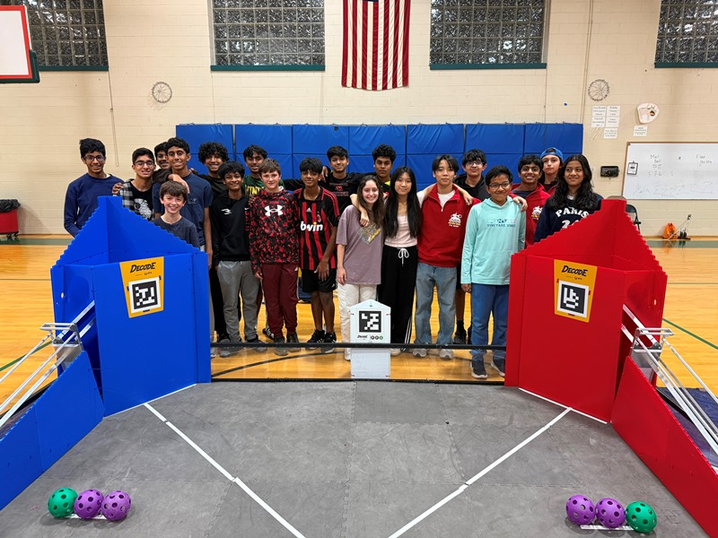
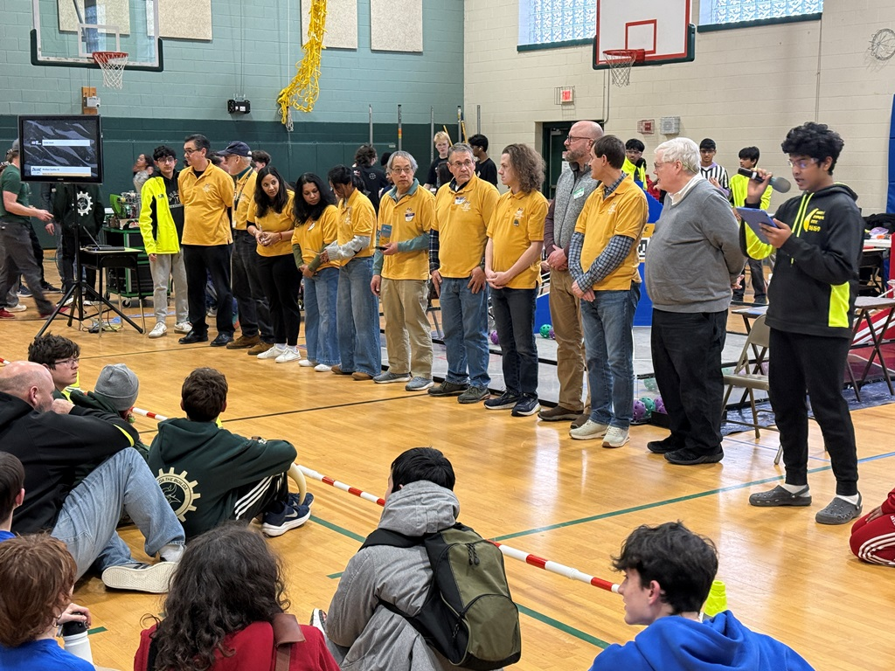

# Our FIRST Outreach

## FTC Scrimmage #2

As a team, we took the opportunity to host the 2nd FIRST Scrimmage at Windham Center School. We divided ourselves into different roles (Field Inspectors, Field Reseters, Queres, Emcees) to keep the event running as efficiently as possible, while also participating in the matches too! In addition, we also worked with our FLL teams to fundraise money for present and future expenses.

Impact: We managed effective and efficient teamwork and witnessed the optimal gameplay strategies. In addition we learned how to manage expenses.

{: style="display: block; margin: 0 auto;" width="600" }

## FTC Qualifier #5

This season, along with our FTC brother and sister teams and FLL teams, Banana Box took the opportunity to host the FTC Qualifier #5. Prior to the event, we organized tables and team information, along with setting up fields. On the day of the event, we split up into different roles to ensure that the event would run smoothly and efficiently.

Impact: We learned to take on new roles (Referee + Inspector) and also how FTC Qualifiers run behind the scenes.

{: style="display: block; margin: 0 auto;" width="600" }

