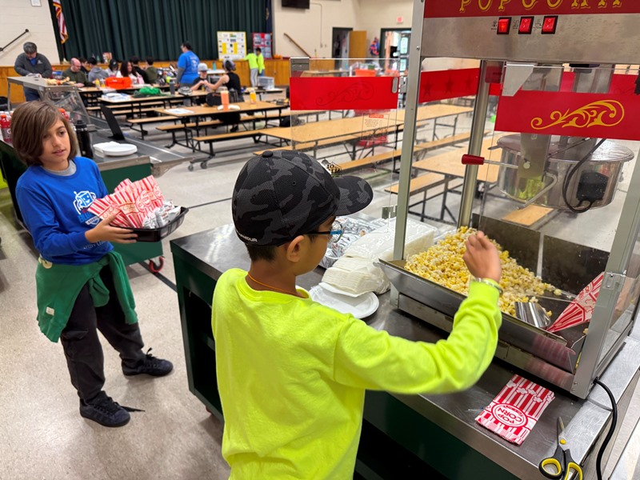
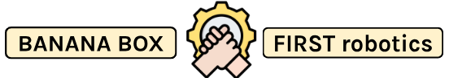

# Our Fundraising

Our fundraising is a crucial part of the Sustainability Plan. To pay for present and future expenses of our team, we need to be generating money during the season. Here is how we did it:

## Concession Stands

{: style="display: block; margin: 0 auto;" width="600" }

Banana Box, partnered with our FLL teams Team Major and Saucy Blue Box, held a concession stands at the FTC Scrimmage #2, FTC Qualifier #5, and FTC State Championship! We sold all times of snacks and drinks including chips, cookies, brownies, popcorn, pizza, water, soda, gatorade, and much more! While this built our organization and teamwork, it also contributed lots of money to our incoming expenses.

## Mission FTC-Possible

{: style="display: block; margin: 0 auto;" width="600" }

Since NH FIRST lost one of their main sponsors, Autodesk, we decided to brainstorm ideas for alternative fundraising. While doing this we came up with Mission FTC-Possible. The plan was to set up a few tables at each FIRST competition for local companies to purchase to advertise their product. W would sell each tables based off the type of competition (scrimmage, qualifier, or state championship). The plan is ongoing, and we are still in the process of communicating with FIRST and following, the companies. 