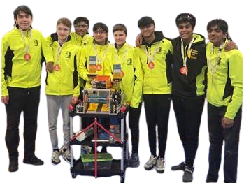
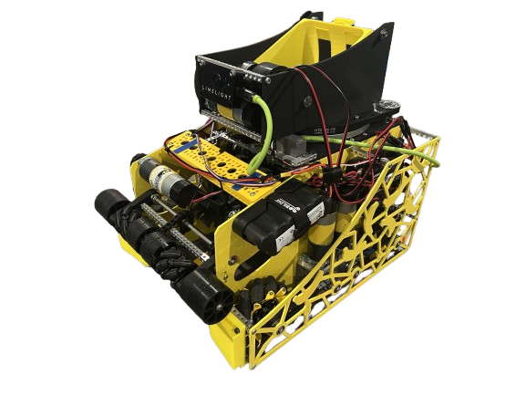

# FTC # 16169 - Banana Box

{: style="display: block; margin: 0 auto;" width="600" }
{: style="display: block; margin: 0 auto;" width="600" }

Welcome to FTC Team 16169 Banana Box’s website! We are a dedicated community team of high school students based in Windham, NH, passionate about robotics and technology. We hope to teach others about FIRST, and share a little insight of our own team and growth.

## Meet the Team

| Name                   | Position(s)                    |
|------------------------|--------------------------------|
| **Rayhan Riaz**        | Team Captain & Main Driver     |
| **Stefan Barbu**       | Promotor, Mechanic             |
| **Ethan Deandrea**     | Lead Programmer, Second Driver | 
| **Kiaan Mehta**        | Programmer, Mechanic           |
| **Govind Valiyodiyil** | Vice-Captain, Lead Designer    |
| **Matthew Dona**       | Lead Scout, Mechanic           |
| **Aditya Biju**        | Lead Mechanic, Co-Human Player |
| **Pranav Mantena**     | Lead Outreach, Human Player    |

## Our Team Goals

ROBOT PERFORMANCE GOAL: By the FTC World Championship, we will reliably score at least 18 artifacts autonomously and consistently cycle (score and reset) artifacts during the driver-controlled phase.

OUTREACH GOAL: By the end of the DECODE season, we will have spread FIRST robotics to hundreds of young learners and professionals, through hands-on workshops and online networking.

### Milestones

| Month              | Robot                                                              | Outreach                                                            |
|--------------------|--------------------------------------------------------------------|---------------------------------------------------------------------|
| April 2025         | CAD & JAVA Programming Refreshers                                  | Plaistow Public Library and Londonderry YMCA (105 Participants)     |
| June & August 2025 | Belt System Drivetrain, Limelight Learning, Team Development       | N/A                                                                 |
| September 2025     | N/A                                                                | Wicked Stem Festival and Thunder Over NH Airshow (20K+ Particpants) |
| October 2025       | CAD ROBOT, FTCSIM Simulation, Prototyping, Design Iterations       | MIT Undergraduate Research Technology Conference (738 Participants) |
| November 2025      | Scrimmage Robot complete, 5 Artifact Autonomous                    | Host NH FTC Scrimmage #2 (23 Teams, 300+ Participants)              |
| December 2025      | Qualifier Robot complete, 9 Artifact Autonomous                    | N/A                                                                 |
| January 2026       | Design and Build State Robot, Construct Autonomous                 | N/A                                                                 |
| February 2026      | Test and Improve Robot Teleop and Autonomous, State Robot Complete | Host NH FTC Qualifier #5 (22 Teams, 300+ Participants)              |

## Social Media

[Instagram: @bananabox_ftc_16169](https://www.instagram.com/bananabox_ftc_16169/)

[YouTube: @FTCBananaBox16169](https://www.youtube.com/@FTCBananaBox16169)
